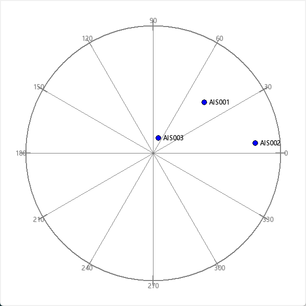

<!--
 Copyright (C) 2023 wwhai

 This program is free software: you can redistribute it and/or modify
 it under the terms of the GNU Affero General Public License as
 published by the Free Software Foundation, either version 3 of the
 License, or (at your option) any later version.

 This program is distributed in the hope that it will be useful,
 but WITHOUT ANY WARRANTY; without even the implied warranty of
 MERCHANTABILITY or FITNESS FOR A PARTICULAR PURPOSE.  See the
 GNU Affero General Public License for more details.

 You should have received a copy of the GNU Affero General Public License
 along with this program.  If not, see <http://www.gnu.org/licenses/>.
-->

# 简单的雷达绘图器
用来绘制雷达图,原理很简单，就是HTTP协议收到坐标数据以后将其画在cavas上。

## 数据
- HTTP URL: http://127.0.0.1:8000/update_radar_data
```json
[
    {
        "x": 100,
        "y": 100,
        "label":"AIS001"
    },
    {
        "x": 200,
        "y": 20,
        "label":"AIS002"
    },
    {
        "x": 10,
        "y": 30,
        "label":"AIS003"
    }
]
```